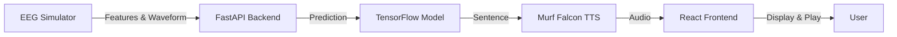

<div align="center">

# 🧠 AntarVani – Neural Speech Decoder

### *Brain-Signal to Natural Speech (Demo Prototype)*

[](https://fastapi.tiangolo.com/)
[](https://reactjs.org/)
[](https://tensorflow.org/)
[](https://murf.ai/)

</div>

---

## 📖 Overview

**AntarVani** is a functional demonstration prototype that simulates *EEG-based speech decoding*. It processes incoming EEG-like signals, predicts user intent using a trained model, and converts the decoded sentence into *natural speech using the Murf Falcon TTS API*.

> ⚠️ This is *not a medical device*, but a **concept demo** built for competition and research purposes.

---

## ✨ Features

<table>
<tr>
<td width="50%">

🎯 **Real-time Processing**
- Simulated EEG → sentence decoding
- Live waveform visualization
- Instant audio feedback

</td>
<td width="50%">

🤖 **AI-Powered**
- TensorFlow classification model
- Murf Falcon TTS integration
- High confidence predictions

</td>
</tr>
<tr>
<td width="50%">

🎨 **Beautiful Interface**
- React dashboard with animations
- Live confidence scores
- Command history display

</td>
<td width="50%">

🔒 **Secure & Local**
- Environment variable handling
- No hardcoded API keys
- Local deployment ready

</td>
</tr>
</table>

---

## 🎬 Demo Video

---

## 🔄 How It Works


### **1️⃣ Simulated EEG Stream**
`simulated_reader.py` sends random EEG-like features & waveform arrays to the backend every second.

### **2️⃣ Backend Processing (FastAPI + TensorFlow)**
- Loads `atarvani_command_model.h5`
- Predicts command index
- Converts index → actual sentence via `label_encoder.pkl`
- Calls *Murf Falcon TTS* and generates an audio file
- Saves audio & latest sentence
- Exposes `/predict`, `/latest`, `/audio`

### **3️⃣ Frontend Display (React + Vite)**
- Polls `/latest` every 1 second
- Renders EEG waveform with animations
- Shows decoded sentence + confidence
- Automatically plays `/audio` whenever sentence changes
- Displays command history beautifully

---

## 📁 Project Structure
```
AntarVani/
│
├── 📂 backend/
│   ├── 🐍 server.py
│   ├── 🔄 simulated_reader.py
│   ├── 📂 model/
│   │   ├── 🧠 atarvani_command_model.h5
│   │   └── 🏷️ label_encoder.pkl
│   └── 📂 venv/
│
├── 📂 frontend/
│   ├── 📂 src/
│   │   ├── ⚛️ App.jsx
│   │   ├── 🎨 premium.css
│   │   └── 📂 components/
│   │       └── 📊 PremiumWaveform.jsx
│   └── 📦 package.json
│
└── 📄 README.md
```

---

## 🚀 Setup Instructions

### **1️⃣ Clone Repository**
```bash
git clone https://github.com/<your-username>/antarvani.git
cd antarvani
```

---

## 🔧 Backend Setup

### **2️⃣ Create Virtual Environment**
```bash
cd backend
python -m venv venv
```

**Activate (Windows)**
```powershell
venv\Scripts\Activate.ps1
```

**Install Dependencies**
```bash
pip install -r requirements.txt
```

---

### **3️⃣ Configure Environment Variables**

Create `backend/.env`:
```env
MURF_API_KEY=your_murf_api_key_here
MURF_VOICE=en-US-natalie
```

> 💡 **To fetch available voices:**
> ```bash
> curl -H "api-key: YOUR_KEY" https://api.murf.ai/v1/speech/voices
> ```

---

### **4️⃣ Run Backend**
```bash
uvicorn server:app --host 0.0.0.0 --port 8000
```

---

### **5️⃣ Start EEG Simulation**

**Open a new terminal:**
```bash
cd backend
venv\Scripts\Activate.ps1
python simulated_reader.py
```

---

## 🌐 Frontend Setup

### **6️⃣ Install & Run**
```bash
cd frontend
npm install
npm run dev
```

**🎉 Frontend URL:** http://localhost:5173

---

## 🔌 API Endpoints

<table>
<tr>
<th>Method</th>
<th>Endpoint</th>
<th>Description</th>
</tr>
<tr>
<td><code>POST</code></td>
<td><code>/predict</code></td>
<td>Send EEG-like features for prediction</td>
</tr>
<tr>
<td><code>GET</code></td>
<td><code>/latest</code></td>
<td>Retrieve latest prediction & confidence</td>
</tr>
<tr>
<td><code>GET</code></td>
<td><code>/audio</code></td>
<td>Get generated audio file URL</td>
</tr>
</table>

### **Example Request**
```json
POST /predict
{
  "features": [1, 2, 3, 4],
  "wave": [0.91, 0.82, 0.21]
}
```

### **Example Response**
```json
GET /latest
{
  "sentence": "I need water",
  "prediction": 1,
  "confidence": 0.97,
  "wave": [...]
}
```

---

## 🔐 Security

<div align="center">

| Feature | Status |
|---------|--------|
| API Keys in Repo | ❌ Not Included |
| Environment Variables | ✅ Managed via `.env` |
| `.env` in `.gitignore` | ✅ Protected |
| Sensitive Credentials | ❌ Not in Codebase |

</div>

---

## 📜 License

<div align="center">

**Creative Commons Attribution–NoDerivatives 4.0 (CC BY-ND 4.0)**

| Permission | Status |
|------------|--------|
| ✅ Public | Allowed |
| ✅ Can Clone | Allowed |
| ❌ Cannot Modify | Restricted |
| ❌ Commercial Use | Restricted |

**Copyright © 2025 Harsh Shirke**  
📧 shirkeharsh6@gmail.com

[Full License](https://creativecommons.org/licenses/by-nd/4.0/)

</div>

---

## 👨‍💻 Credits

<div align="center">

**Developed by Harsh Shirke**  
*For hackathon, prototype & research demonstration*

📧 **Contact:** shirkeharsh6@gmail.com

---

### ⭐ If you like this project, kindly star the repository on GitHub!

</div>
